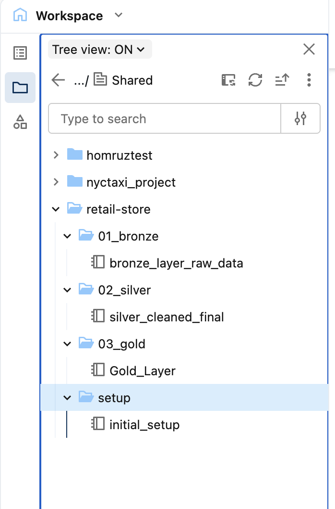
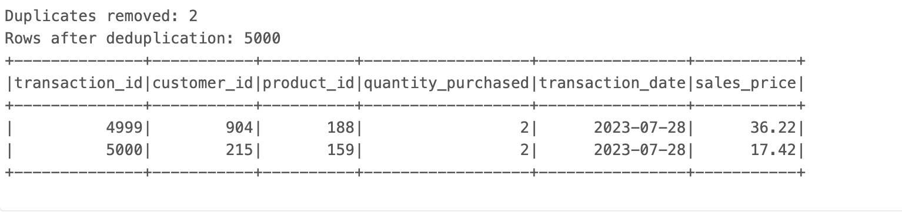
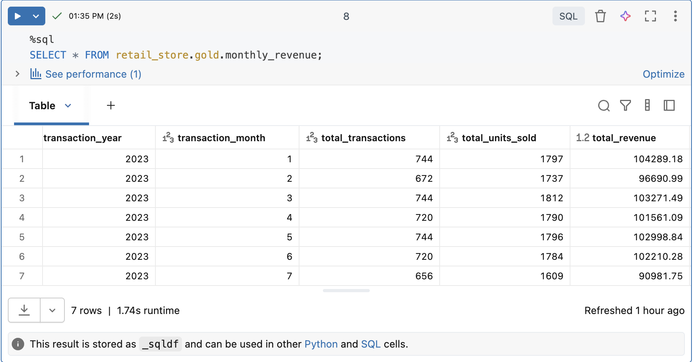

# Retail Store Data Pipeline (Databricks)

This project was built to learn and understand end-to-end data pipeline workflows on the Databricks platform. It takes raw retail data (sales transactions, customer profiles, product inventory) and processes it through a Bronze-Silver-Gold medallion architecture, ending with business-ready tables for analytics.

It's not a production system -- it's a learning project I built to get hands-on experience with PySpark, Delta Lake, and Unity Catalog.

## Architecture

The pipeline follows the [medallion architecture](https://www.databricks.com/glossary/medallion-architecture) pattern with three layers:

```
CSV files (raw data)
    |
    v
[Bronze] Raw ingestion -- load CSVs as-is into Delta tables, add metadata
    |
    v
[Silver] Cleaned data -- fix types, remove duplicates, handle nulls, correct prices
    |
    v
[Gold] Business tables -- aggregated views ready for analysis (revenue, product performance, etc.)
```

**Bronze**: Reads the three CSV files and writes them to Delta tables without transforming anything. Adds `_processed_timestamp` and `_source_file` columns so you can trace where each row came from.

**Silver**: This is where most of the work happens. Each table gets type-cast to proper data types, deduplicated, and cleaned. The sales transactions table also gets its prices corrected by joining against the product inventory (using inventory price as the source of truth).

**Gold**: Joins the silver tables together and creates aggregated views -- monthly revenue, product performance rankings, and customer spending summaries. This layer is all SQL.

## Tech Stack

- **Databricks** (notebooks, Unity Catalog, Volumes)
- **PySpark** for Bronze and Silver transformations
- **Spark SQL** for Gold layer aggregations
- **Delta Lake** for table storage

## Project Structure

```
retail-store-port/
|-- setup/
|   |-- initial_setup.ipynb          # Creates catalog, schemas, and volume
|-- 01_bronze/
|   |-- bronze_layer_raw_data.ipynb  # Raw CSV ingestion into Delta tables
|-- 02_silver/
|   |-- silver_cleaned_final.ipynb   # Data cleaning and transformation
|-- 03_gold/
|   |-- Gold_Layer.ipynb             # Business-ready aggregated tables
|-- data/
|   |-- customer_profiles.csv       # 1,000 customer records
|   |-- product_inventory.csv       # 200 products
|   |-- sales_transaction.csv       # 5,002 transactions
```

## How to Run

This was built on the **free edition of Databricks**.

1. **Create a workspace folder** called `retail-store` and set up the notebook structure like this:
   ```
   retail-store/
   |-- 01_bronze/
   |   |-- bronze_layer_raw_data
   |-- 02_silver/
   |   |-- silver_cleaned_final
   |-- 03_gold/
   |   |-- Gold_Layer
   |-- setup/
   |   |-- initial_setup
   ```
   You can import the `.ipynb` files directly into your workspace.

   


2. **Cluster**: Attach a cluster with Unity Catalog enabled (the default single-node cluster on the free edition works fine).

3. **Upload data**: Upload the three CSV files from the `data/` folder to a Databricks Volume. The pipeline expects them at:
   ```
   /Volumes/retail_store/bronze/raw_data/
   ```
   (The `setup/initial_setup` notebook creates this volume for you -- run it first, then upload the files.)

4. **Run notebooks in order**:
   1. `setup/initial_setup` -- creates the catalog, schemas, and volume
   2. `01_bronze/bronze_layer_raw_data` -- ingests raw data
   3. `02_silver/silver_cleaned_final` -- cleans and transforms (run product inventory section first, since sales transactions joins against it for price correction)
   4. `03_gold/Gold_Layer` -- builds aggregated tables

## Data Source

The data is synthetic CSV files representing a retail store:

| File | Records | Description |
|------|---------|-------------|
| `customer_profiles.csv` | 1,000 | Customer demographics (age, gender, location, join date) |
| `product_inventory.csv` | 200 | Products with categories, stock levels, and prices |
| `sales_transaction.csv` | 5,002 | Transaction records linking customers to products |

The data has intentional quality issues that the Silver layer handles -- missing locations, empty gender fields, price mismatches between transactions and inventory, and some duplicate records.

## Sample Output

**Silver layer** -- deduplication results showing 2 duplicate transactions identified and removed:



**Gold layer** -- monthly revenue aggregation table:



## Key Design Decisions

- **Schema inference disabled in Bronze**: I set `inferSchema=false` so the raw data stays as strings in Bronze. All the type casting happens in Silver, which keeps Bronze as a true "raw" layer.

- **Inventory price as source of truth**: Sales transactions sometimes have different prices than the product inventory. The Silver layer joins against inventory to correct these and flags the mismatches so you can see how many there were.

- **Overwrite mode for all writes**: To keep things simple, every table write uses `mode("overwrite")`. Switching to incremental loads is something I want to explore next (mentioned in Future Improvements).

## What I Learned

This was my first time building a full pipeline from scratch, and a few things clicked for me:

- **Why the medallion architecture exists.** I understand the logic behind separating raw, cleaned, and aggregated data now. When I messed up my Silver transformations, I could just re-run from Bronze instead of re-ingesting everything.

- **Data cleaning ended up being most of the work in this project.** I spent way more time on the Silver layer than I expected. Working through the price mismatches made me realize that many of these choices are not just technical—they depend on context-specific business logic.
- **Unity Catalog's three-level namespace.** Got comfortable with how `catalog.schema.table` works and using separate schemas to organize each layer.

- **Window functions for deduplication.** I used `row_number()` with a window to deduplicate transactions instead of just `dropDuplicates()`, because I wanted to keep the earliest transaction when there were dupes. This was probably the trickiest part of the project for me.

## Future Improvements

- **Add error handling** -- right now if a file is missing or a cast fails, the notebook just crashes. Adding try/except blocks and better validation would make it more robust.
- **Switch to incremental loads** -- using `MERGE INTO` instead of full overwrites so the pipeline can handle new data without reprocessing everything.
- **Learn Delta Live Tables (DLT)** -- I want to try rebuilding this pipeline using DLT, which handles a lot of the orchestration and data quality stuff automatically instead of managing it all manually in notebooks.
